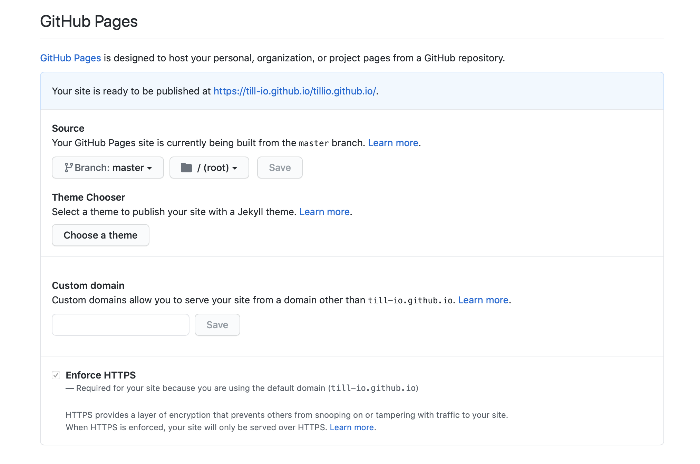

# till.io website

This repository contains all the code for our till.io website. The website is hosted via GitHub. The design is inspired by <a href="https://html5up.net/solid-state">Solid State</a> by <code>@ajlkn</code>.

## Overview

The website is fully responsive and <code>HTML</code>, <code>CSS</code> and <code>JS</code> based. All images where created by us using <a href="https://www.sketch.com">Sketch</a>. 

  

We use GitHub Pages to host the website. As the website is static and quite simplistic, we don't need a more advanced hosting mechanism. The following specs define the source files for the website.

  

## Contact

The website can be reached via <code>https://xx.io</code>For any question or inqueries regarding the website, please contact <a href="mailto:info@tillio.com">Lukas</a>.

